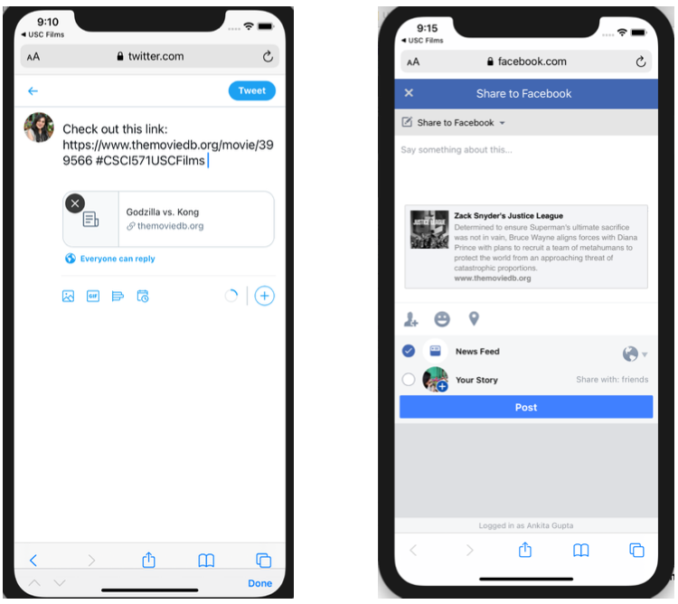
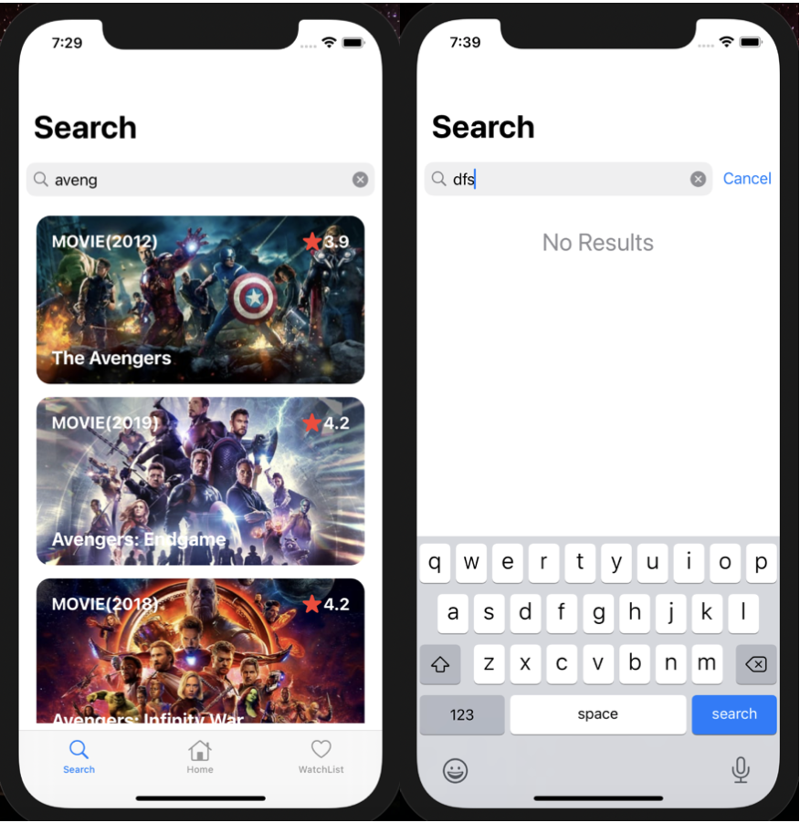

# USC-Films-IOS-APP
## Project Description
1. Developed an IOS App using swift language
2. Developed backend using Nodejs and deployed on Azure
3. Practice the Model-View-ViewModel (MVVM) design pattern.

